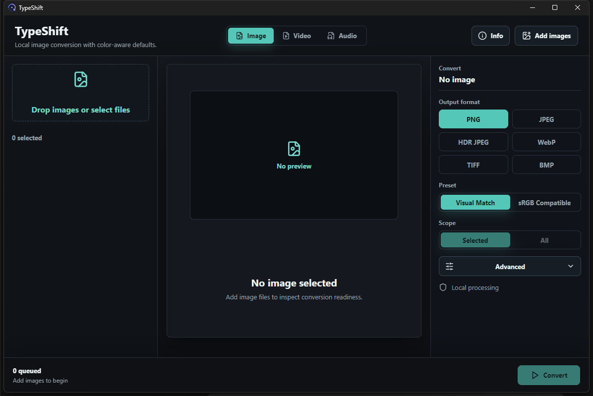
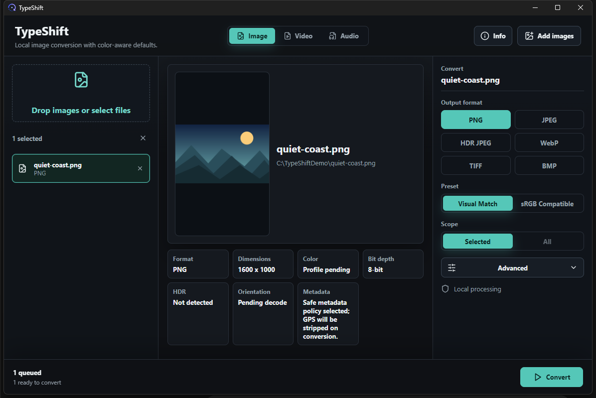

# TypeShift

TypeShift is a Windows-first local media converter built with Tauri, React,
TypeScript, and Rust. The current working module focuses on image conversion
with careful handling for HEIC/HEIF sources, metadata policy, and HDR/gain-map
output. The video workspace is implemented; the audio workspace is reserved
for a future converter module.

## Screenshots

### Image Workspace



### Sample Image in Queue



The repository includes a synthetic image for safe demos and manual checks:
[quiet-coast.png](docs/sample-data/quiet-coast.png). It contains no personal
photo or identifying metadata.

## Current Features

- Local-only desktop app. Files are processed on the machine and originals are
  not modified.
- Drag-and-drop or file picker image queue.
- Convert the selected image or the full queue.
- Output formats: PNG, JPEG, HDR JPEG, WebP, TIFF, and BMP.
- Input inspection for HEIC/HEIF, PNG, JPEG, WebP, TIFF, BMP, GIF, and ICO.
- Native HEIC preview generation through bundled `libheif` in release builds.
- Safe output naming beside the source file, for example
  `photo.typeshift.png` and `photo.typeshift-1.png`.
- Native JPEG metadata preservation for standard EXIF/XMP/ICC payloads.
- Safe metadata mode strips GPS/location metadata after copy.
- HDR JPEG mode uses the native HEIC primary/gain-map path and refuses SDR
  fallback for that target.
- Image and Video conversion workspaces are implemented. Audio is currently a
  reserved workspace.
- In-app Info panel shows creator, ownership, license status, and opens
  [amirsrad.ir](https://amirsrad.ir) in the system browser.
- Video conversion uses FFmpeg/FFprobe. The backend discovers tools beside the
  executable or on PATH; local development can use `src-tauri/bin/ffmpeg/`.

## Status

This is an early Windows-focused image-converter build. Normal raster outputs
are SDR compatibility exports. HDR JPEG is the dedicated gain-map output mode
for supported iPhone HEIC sources.

Future work is expected around:

- broader fixture coverage for color accuracy
- Apple-compatible Portrait/Live Photo metadata embedding
- stronger ICC/LittleCMS validation paths
- audio and video conversion domains

## Project Layout

```text
src/                 React + TypeScript frontend
src-tauri/src/       Rust Tauri commands and conversion engine
src-tauri/vendor/    Patched vendored libheif-sys dependency
docs/                Image pipeline and native dependency notes
docs/sample-data/    Generated, metadata-free demo image
```

## Developer Documentation

- [Developer overview](docs/developer-overview.md)
- [Frontend architecture](docs/frontend-architecture.md)
- [Backend architecture](docs/backend-architecture.md)
- [Developer workflows](docs/developer-workflows.md)
- [Image pipeline](docs/image-pipeline.md)
- [Native dependencies](docs/native-dependencies.md)
- [Windows libheif auxiliary backend](docs/windows-libheif-auxiliary-backend.md)

## Project Info

- Creator: Amirsalar Saberi rad
- Website: [amirsrad.ir](https://amirsrad.ir)
- Ownership: TypeShift application code, branding, UI design, and original
  project assets are owned by Amirsalar Saberi rad.

## Windows installation

Windows release builds produce an NSIS setup executable and an MSI installer.
The NSIS setup installs for the current user and adds a shortcut under
**Start Menu → TypeShift**. The app does not start automatically when Windows
starts; add the shortcut to the Startup folder yourself if you want that.

The installer uses Tauri's WebView2 bootstrapper mode. Windows 10/11 normally
provides WebView2; a machine missing the runtime needs an internet connection
during installation. Release installers are not code-signed yet. Windows can
show an unknown-publisher or SmartScreen warning; configure trusted
Authenticode signing before a public release.

Video conversion requires compatible `ffmpeg.exe` and `ffprobe.exe`
beside the installed app in an `ffmpeg/` folder, or FFmpeg available on PATH.
Those binaries are not included in the public repository or default installer.
Before redistributing FFmpeg, review the exact build's license and codec
configuration and include the required notices.

## Prerequisites

- Windows 10/11
- Node.js and npm
- Rust stable
- Tauri v2 CLI through `npm`
- Visual Studio Build Tools for Rust/Tauri native builds
- For native HEIC/HDR builds: the native dependencies and environment described
  in [Native dependencies](docs/native-dependencies.md)

JPEG metadata copying is built into the Rust app. It preserves standard
EXIF/XMP/ICC data for JPEG outputs, normalizes orientation after pixels are
rendered, and strips readable location references in safe metadata mode.

## Development

Install dependencies:

```powershell
npm install
```

Run the frontend dev server:

```powershell
npm run dev -- --host 127.0.0.1
```

Run checks:

```powershell
npm test -- --run
npm run build
cd src-tauri
cargo test --features native-heif
```

## Release Build

Use Tauri for release builds so the frontend is embedded in the executable and
the configured Windows installers are packaged. Plain `cargo build --release`
is not enough because it can leave the executable pointing at the dev server.

Build the Windows installers:

For native HEIC/HDR support, set up the local Windows build variables in
[Native dependencies](docs/native-dependencies.md) first.

```powershell
npm run tauri -- build --features native-heif
```

The Windows setup executable and MSI are written under:

```text
src-tauri/target/release/bundle/nsis/
src-tauri/target/release/bundle/msi/
```

The standalone executable is at `src-tauri/target/release/typeshift.exe`.
Use the NSIS `.exe` for a guided setup and the MSI for Windows Installer tools.
Configure Authenticode signing before distributing a public release broadly.

## Git Notes

Generated output is ignored, including:

- `dist/`
- `node_modules/`
- `src-tauri/target*/`
- `src-tauri/gen/`
- local converted outputs such as `*.typeshift.*`
- local HEIC/HEIF photo samples
- local FFmpeg tools in `src-tauri/bin/ffmpeg/`
- `.freebuff/` task metadata

The only committed sample image is the generated, metadata-free fixture under
`docs/sample-data/`. Do not add personal photos or screenshots that expose
private image content, names, or file paths.

## License

See [LICENSE](LICENSE).

Copyright (c) Amirsalar Saberi rad. All rights reserved.

TypeShift is proprietary software. No permission is granted to copy, modify,
redistribute, sublicense, or use the TypeShift application code, branding, UI
design, or original project assets without explicit written permission from
Amirsalar Saberi rad.

Third-party dependencies and vendored libraries remain under their respective
licenses.
