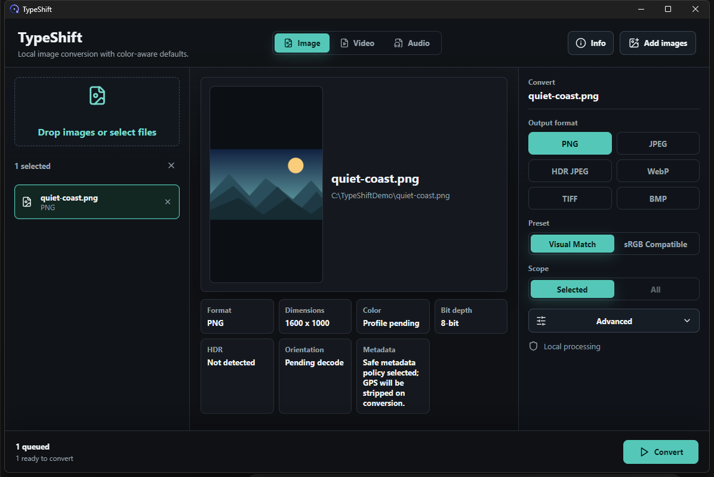

# TypeShift

TypeShift is a Windows-first local image converter built with Tauri, React,
TypeScript, and Rust. The current app focuses on image conversion with careful
handling for HEIC/HEIF sources, metadata policy, and HDR/gain-map output.



## Current Features

- Local-only desktop app. Files are processed on the machine and originals are
  not modified.
- Drag-and-drop or file picker image queue.
- Convert the selected image or the full queue.
- Output formats: PNG, JPEG, HDR JPEG, WebP, TIFF, and BMP.
- Input inspection for HEIC/HEIF, PNG, JPEG, WebP, TIFF, BMP, GIF, and ICO.
- Native HEIC preview generation through bundled `libheif` in release builds.
- Safe output naming beside the source file, for example
  `photo.typeshift.png` and `photo.typeshift-1.png`.
- Native JPEG metadata preservation for standard EXIF/XMP/ICC payloads.
- Safe metadata mode strips GPS/location metadata after copy.
- HDR JPEG mode uses the native HEIC primary/gain-map path and refuses SDR
  fallback for that target.

## Status

This is an early Windows-focused image-converter build. Normal raster outputs
are SDR compatibility exports. HDR JPEG is the dedicated gain-map output mode
for supported iPhone HEIC sources.

Future work is expected around:

- broader fixture coverage for color accuracy
- Apple-compatible Portrait/Live Photo metadata embedding
- stronger ICC/LittleCMS validation paths
- audio and video conversion domains

## Project Layout

```text
src/                 React + TypeScript frontend
src-tauri/src/       Rust Tauri commands and conversion engine
src-tauri/vendor/    Patched vendored libheif-sys dependency
docs/                Image pipeline and native dependency notes
```

## Developer Documentation

- [Developer overview](docs/developer-overview.md)
- [Frontend architecture](docs/frontend-architecture.md)
- [Backend architecture](docs/backend-architecture.md)
- [Developer workflows](docs/developer-workflows.md)
- [Image pipeline](docs/image-pipeline.md)
- [Native dependencies](docs/native-dependencies.md)

## Prerequisites

- Windows 10/11
- Node.js and npm
- Rust stable
- Tauri v2 CLI through `npm`
- Visual Studio Build Tools for Rust/Tauri native builds
- Native dependency environment used by the current project:
  - `VCPKG_ROOT=C:\vcpkg-master`
  - `CMAKE_GENERATOR=Ninja`
  - `CMAKE_PREFIX_PATH=C:\vcpkg-master\installed\x64-windows-static-md`
  - `PKG_CONFIG=C:\vcpkg-master\downloads\tools\msys2\1e74ca60daa10104\mingw64\bin\pkg-config.exe`

JPEG metadata copying is built into the Rust app. It preserves standard
EXIF/XMP/ICC data for JPEG outputs, normalizes orientation after pixels are
rendered, and strips readable location references in safe metadata mode.

## Development

Install dependencies:

```powershell
npm install
```

Run the frontend dev server:

```powershell
npm run dev -- --host 127.0.0.1
```

Run checks:

```powershell
npm test -- --run
npm run build
cd src-tauri
cargo test --features native-heif
```

## Release Build

Use Tauri for release builds so the frontend is embedded in the executable.
Plain `cargo build --release` is not enough for this app because it can leave
the executable pointing at the development server.

Build the release executable without MSI/installer output:

```powershell
$env:VCPKG_ROOT='C:\vcpkg-master'
$env:CMAKE_GENERATOR='Ninja'
$env:CMAKE_PREFIX_PATH='C:\vcpkg-master\installed\x64-windows-static-md'
$env:PKG_CONFIG='C:\vcpkg-master\downloads\tools\msys2\1e74ca60daa10104\mingw64\bin\pkg-config.exe'
npx tauri build --no-bundle --features native-heif
```

The executable is written to:

```text
src-tauri/target/release/typeshift.exe
```

## Git Notes

Generated output is ignored, including:

- `dist/`
- `node_modules/`
- `src-tauri/target*/`
- `src-tauri/gen/`
- local converted outputs such as `*.typeshift.*`
- local sample HEIC files

Do not commit personal photo samples. Add sanitized fixtures later under a
dedicated fixture folder when the test suite is ready for them.

## License

This project is currently marked `UNLICENSED` in `src-tauri/Cargo.toml`.
